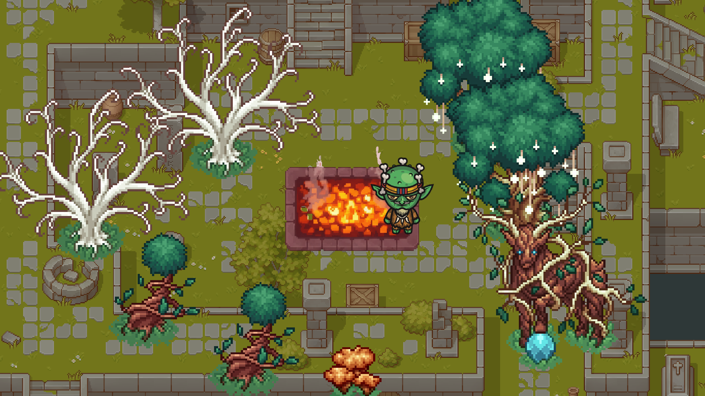
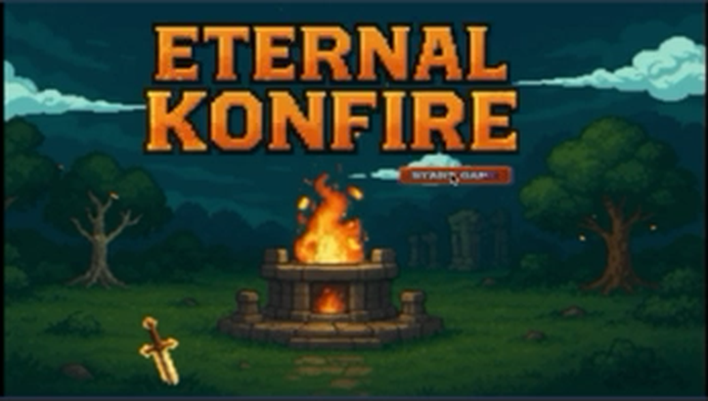

# 🔥 Eternal Konfire

A 2D top-down survival arcade game prototype originally developed during a game development course at Mercantec and fully restored into a clean, complete Unity project.



---

## 📖 Story & Overview

You play as a solitary goblin guardian in an ancient stone courtyard. In the center burns the sacred **Eternal Bonfire**. As darkness looms, the enchanted forest grows uncontrollably, creeping into the courtyard. 

Your mission is simple but perilous: chop trees for firewood, feed the sacred bonfire before the flames die out, and beware the mystical **Forest Spirit (Ghost Cat)** that awakens to hunt you once the forest reaches critical density.



---

## 🎮 Gameplay & Mechanics

### 1. Bonfire Management & Survival
* **Fuel Drain:** The bonfire constantly consumes fuel over time (`burnRate = 2`). If fuel hits zero, the fire extinguishes and the game ends.
* **Harvesting Wood:** Approach trees and press **Spacebar** to chop. Each hit chips away at the tree's health until it collapses and drops a wood log.
* **Log Transport:** Pick up a log (indicated by a wood thought bubble over the player) and deliver it to the central bonfire to restore +25 fuel and score +50 points.

### 2. Sacred Altar Buffs
Feeding the bonfire has a random chance (25%) to trigger ancient altar blessings:
* 🌸 **Fury Buff:** Grants instant super-strength for 7 seconds, felling any tree in a single chop.
* 🔷 **Forest Ward:** Emits a shockwave that instantly purges encroaching trees across the courtyard.

### 3. Dynamic Forest Growth & Difficulty Escalation
* **Procedural Spawning:** Trees spawn randomly throughout the clearing with collision and safe-zone checks (`ForestManager.cs`).
* **Adaptive Difficulty:** As time passes, the spawn delay decreases progressively, causing the forest to encroach faster and faster.

### 4. The Forest Spirit (Ghost Cat)
* Once the forest reaches a critical number of trees (randomized between 40 and 60), the ominous **Ghost Cat** spawns with an eerie sound effect.
* The spirit stalks the player relentlessly through physics-based tracking (`GhostCatAI.cs`). Touching the cat ends the game immediately.

---

## 🕹 Controls

| Action | Key / Input |
|---|---|
| **Move** | `W`, `A`, `S`, `D` or Arrow Keys |
| **Chop Tree / Pick Log / Fuel Fire** | `Spacebar` |
| **Menu Navigation** | Mouse Click |

---

## 🛠 Tech Stack & Architecture

* **Engine:** Unity 6 (6000.6.3f1) — Built-in 2D Render Pipeline
* **Language:** C# (.NET Standard 2.1)
* **Input System:** Unity New Input System (`PlayerInputActions`)
* **Audio:** 2D spatial & ambient audio with sound effects for chopping, fire ignition, footsteps, and ghost cat appearances.
* **Architecture:** Component-based architecture with clean singleton managers (`GameManager`, `ForestManager`).

### Project Directory Structure
```
Assets/
├── Cainos/                 # Town tileset, props, stone structures & vegetation
├── _Konfire/
│   ├── Animations/         # Blend trees, Goblin directional walk/idle/chop, Bonfire loop
│   ├── Audio/              # SFX & original soundtrack ("Lost in the Pixel Pines")
│   ├── Prefabs/            # Player, Bonfire, GhostCat, Log, Tree variants
│   ├── Scenes/             # MainMenu.unity, GameScene.unity
│   ├── Scripts/
│   │   ├── Core/           # GameManager, Bonfire
│   │   ├── Player/         # PlayerController, Input Actions
│   │   ├── UI/             # MainMenuManager, SceneNavigation
│   │   └── World/          # ForestManager, GhostCatAI, Tree
│   └── Sprites/            # Extracted & calibrated sprites (Trees, Goblin, Bonfire, UI)
```

---

## 🚀 Getting Started

1. Clone this repository:
   ```bash
   git clone https://github.com/deusflow/EnternalKonfire.git
   ```
2. Open the project folder in **Unity Hub** (Unity 6.0+ recommended).
3. Open `Assets/Scenes/MainMenu.unity`.
4. Press **Play** in the Unity Editor or build for your platform (macOS / Windows / WebGL).
